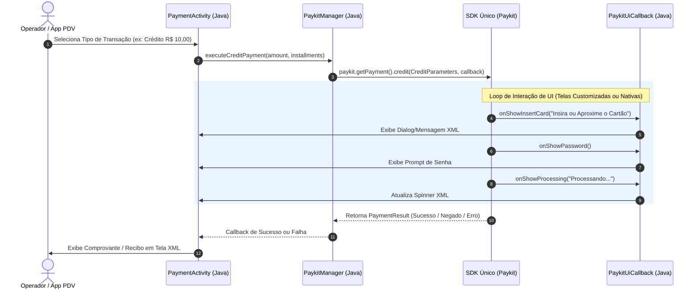

# System Design & Planejamento: App Exemplo de Integração do SDK Único (Java + XML + Groovy)

Este documento apresenta a arquitetura, o planejamento estrutural e o design de sistema para a criação de uma aplicação de demonstração (Demo App) do **SDK Único (Linx Paykit / SDK Pay Services)** utilizando a stack tradicional Android: **Java**, **Layouts XML** e **Build Scripts Gradle em Groovy**.

> [!NOTE]
> Este documento serve como guia arquitetural e referência técnica para desenvolvedores que desejam integrar o **SDK Único** em seus próprios sistemas de automação comercial e Ponto de Venda (PDV) desenvolvidos em Java.

---

## 1. Visão Geral e Objetivos

O **SDK Único** é uma solução unificada para comunicação com adquirentes e redes de TEF em dispositivos Android/POS (Cielo, Rede, Stone, PagSeguro, SiTef, LinxTEF, Vero, Getnet, Gsurf, Sicoob, etc.).

### Objetivos do Projeto Exemplo em Java:
1. **Modelar a Integração Padrão**: Demonstrar a inicialização, ativação e execução de pagamentos em Java sem dependências de Kotlin Compose ou Coroutines.
2. **Suportar Duas Modos de Interface (UI)**:
   - **Telas Nativas do SDK**: O próprio SDK gerencia a interação com o usuário (inserir cartão, digitar senha, mensagens de status).
   - **Telas Customizadas da Aplicação**: A aplicação hospeda a interface via Callbacks (`PaykitUiCallback`), exibindo seus próprios `Dialogs` e telas em XML.
3. **Oferecer Clareza de Configuração**: Mostrar como configurar o `build.gradle` (Groovy) com múltiplos `productFlavors` para cada adquirente.

---

## 2. Arquitetura de Sistema (System Design)

A arquitetura foi projetada seguindo o padrão de separação de responsabilidades (Clean Architecture / MVC adaptado para Android), isolando o SDK Único do restante da aplicação.

```mermaid
graph TD
    subgraph UI Layer [Camada de Apresentação (XML + Java)]
        A[MainActivity / PaymentActivity] -->|ViewBinding / XML| B[Layouts XML / Dialogs Customizados]
        A -->|Eventos de Botão| C[PaymentPresenter / ViewModel Java]
    end

    subgraph Domain Layer [Camada de Negócio / Orquestração]
        C -->|Invoca Operações| D[PaykitManager Java]
        E[PaykitCustomUiCallbackHandler] -->|Notifica UI via Handler/LiveData| C
    end

    subgraph SDK Layer [SDK Único (SDKPayServices)]
        D -->|Constrói & Configura| F[Paykit / PaykitFactory]
        F -->|Ativação & Vendas| G[Core SDK PayServices]
        G -->|Eventos de Interface| E
    end

    subgraph Hardware / Pinpad [Terminal POS]
        G <-->|Comunicação com Pinpad / Chip| H[Hardware do Dispositivo / Adquirente]
    end
```

---

## 3. Fluxo de Execução e Ciclo de Vida da Transação

### 3.1. Sequência de Ativação e Venda



---

## 4. Estrutura Proposta do Projeto (Java + XML + Groovy)

Abaixo está a estrutura de diretórios planejada para a aplicação de exemplo em Java:

```
SDKPayServicesDemoApp_Java/
├── gradle/
│   └── wrapper/
├── app/
│   ├── build.gradle                          <-- Configuração Groovy com Flavors
│   ├── proguard-rules.pro
│   └── src/
│       ├── main/
│       │   ├── AndroidManifest.xml
│       │   ├── assets/
│       │   │   └── recibo.png
│       │   ├── java/
│       │   │   └── com/linx/paykit/demo/java/
│       │   │       ├── PaykitApp.java        <-- Inicialização global (Application)
│       │   │       ├── paykit/
│       │   │       │   ├── PaykitManager.java               <-- Helper de inicialização e chamadas do SDK
│       │   │       │   ├── PaykitCustomUiCallbackHandler.java <-- Implementação de PaykitUiCallback
│       │   │       │   └── ActivationCacheManager.java      <-- Cache do status de ativação em SharedPreferences
│       │   │       ├── model/
│       │   │       │   ├── PaymentRequest.java              <-- Model DTO para tela
│       │   │       │   └── TransactionLog.java              <-- Model de Logs
│       │   │       ├── ui/
│       │   │       │   ├── MainActivity.java                <-- Tela principal e seleção de operações
│       │   │       │   ├── PaymentActivity.java             <-- Fluxo de pagamento e ativação
│       │   │       │   ├── CustomUiPaymentActivity.java     <-- Exemplo de UI 100% customizada em XML
│       │   │       │   └── dialogs/
│       │   │       │       ├── CustomInputDialog.java       <-- Dialog para digitação de senha/dados
│       │   │       │       ├── CustomMenuDialog.java        <-- Dialog para menus de opções
│       │   │       │       └── QrCodeDialog.java            <-- Dialog para exibição de QR Code do PIX
│       │   │       └── util/
│       │   │           ├── CurrencyFormatter.java           <-- Formatador de valores
│       │   │           └── BitmapUtils.java                 <-- Auxiliar para recibos
│       │   └── res/
│       │       ├── layout/
│       │       │   ├── activity_main.xml
│       │       │   ├── activity_payment.xml
│       │       │   ├── activity_custom_ui_payment.xml
│       │       │   ├── dialog_input.xml
│       │       │   ├── dialog_menu.xml
│       │       │   ├── dialog_qrcode.xml
│       │       │   └── item_transaction_log.xml
│       │       ├── values/
│       │       │   ├── colors.xml
│       │       │   ├── strings.xml
│       │       │   └── styles.xml
│       │       └── xml/
│       ├── test/
│       └── androidTest/
├── build.gradle                              <-- Build script raiz em Groovy
├── gradle.properties                         <-- Credenciais do repositório Maven
└── settings.gradle                           <-- Inclusão de módulos em Groovy
```

---

## 5. Planejamento de Configuração do Gradle em Groovy

### 5.1. `gradle.properties`
Contém as credenciais de acesso ao repositório Maven privado do SDK Único:

```properties
sdkPayServicesRepositoryUser=SEU_USUARIO_DEV
sdkPayServicesRepositoryPassword=SUA_SENHA_DEV
```

### 5.2. `build.gradle` (Projeto Raiz em Groovy)
```groovy
buildscript {
    repositories {
        google()
        mavenCentral()
    }
    dependencies {
        classpath 'com.android.tools.build:gradle:8.2.2'
    }
}

allprojects {
    repositories {
        google()
        mavenCentral()
        maven {
            url "https://equals.jfrog.io/artifactory/sdk-unico-android-release-local"
            credentials {
                username = project.findProperty("sdkPayServicesRepositoryUser") ?: ""
                password = project.findProperty("sdkPayServicesRepositoryPassword") ?: ""
            }
        }
    }
}
```

### 5.3. `app/build.gradle` (Módulo em Groovy)
Planejamento dos `productFlavors` e dependências do SDK Único:

```groovy
apply plugin: 'com.android.application'

def sdkPayServicesVersion = "2.2.0.+"
def adquirenteDefault = "linxtef"

android {
    namespace 'com.linx.paykit.demo.java'
    compileSdk 34

    defaultConfig {
        applicationId "com.linx.paykit.demo.java"
        minSdk 21
        targetSdk 34
        versionCode 1
        versionName "1.2.0"
        testInstrumentationRunner "androidx.test.runner.AndroidJUnitRunner"
    }

    compileOptions {
        sourceCompatibility JavaVersion.VERSION_11
        targetCompatibility JavaVersion.VERSION_11
    }

    buildFeatures {
        viewBinding true
    }

    flavorDimensions "providers"
    productFlavors {
        linxtef { dimension "providers"; minSdk 22 }
        cielo { dimension "providers"; minSdk 25 }
        stone { dimension "providers"; minSdk 22 }
        rede { dimension "providers"; minSdk 22 }
        pagseguro { dimension "providers"; minSdk 23 }
        sitef { dimension "providers"; minSdk 22 }
        getnet { dimension "providers"; minSdk 22 }
        vero { dimension "providers"; minSdk 22 }
    }
}

configurations.all {
    resolutionStrategy.cacheDynamicVersionsFor 30, 'minutes'
    exclude group: 'com.gertec', module: 'ppcomp-gpos780-release'
}

dependencies {
    // AndroidX & UI Tradicional (XML)
    implementation 'androidx.appcompat:appcompat:1.6.1'
    implementation 'com.google.android.material:material:1.11.0'
    implementation 'androidx.constraintlayout:constraintlayout:2.1.4'

    // Auxiliares
    implementation 'com.google.zxing:core:3.5.3'

    // SDK Único Libs (Injetado conforme flavor ativo)
    implementation "SDKPayServices:core-${adquirenteDefault}:${sdkPayServicesVersion}"
    implementation "SDKPayServices:${adquirenteDefault}:${sdkPayServicesVersion}"
    implementation "SDKPayServices:config:${sdkPayServicesVersion}"
    implementation "SDKPayServices:common:${sdkPayServicesVersion}"
}
```

---

## 6. Design das Classes Principais em Java

### 6.1. Manager do SDK (`PaykitManager.java`)
Responsável por encapsular a fábrica do SDK Único e expor métodos limpos para a `Activity`.

- **Responsabilidades**:
  - Instanciar o `Paykit` usando `PaykitFactory` e `Parameters`.
  - Gerenciar a configuração de `ActivationParameters` (CNPJ, Token TEF, TipoServidor).
  - Configurar o modo de interface (`PaykitUiModel.build(...)` para Telas Nativas ou Telas Customizadas via `PaykitUiCallback`).
  - Executar métodos assíncronos de transação (`credit`, `debit`, `pix`, `voucher`, `cancel`, `reprint`).

### 6.2. Manipulador de Callbacks Nativos (`PaykitCustomUiCallbackHandler.java`)
Implementa a interface `PaykitUiCallback` do SDK Único em Java para direcionar chamadas de UI para a thread principal (`MainThread` / `Handler`).

- **Métodos a Implementar**:
  - `onShowAlert(String message)`
  - `onShowMenu(String label, String[] items, Function1 operationResult)`
  - `onShowError(String message)`
  - `onShowMessage(String message)`
  - `onShowInsertCard(String message)`
  - `onShowProcessing(String message)`
  - `onShowRemoveCard(String message)`
  - `onShowConfirmation(String message, Function1 operationResult)`
  - `onShowInput(InputParameters parameters, Function1 operationResult)`
  - `onShowQrCode(String message, String qrCode, int timeout)`
  - `onShowPassword()`

### 6.3. Dialogs Nativos XML para Telas Customizadas
Para responder às solicitações do `PaykitUiCallback`, a aplicação utilizará Dialogs padrão em XML:
- `CustomInputDialog`: Digitação de dados/senhas.
- `CustomMenuDialog`: Seleção de opções (ex: tipo de parcelamento, vias de comprovante).
- `QrCodeDialog`: Renderização do Bitmap do QR Code via biblioteca ZXing.

---

## 7. Mapeamento de Funcionalidades do SDK Único

| Funcionalidade | Classe do SDK Único | Método Utilizado |
| :--- | :--- | :--- |
| **Inicialização** | `PaykitFactory` | `.build(Parameters)` |
| **Ativação** | `Paykit` | `.activate(ActivationParameters, Callback)` |
| **Venda Crédito** | `Paykit` -> `Payment` | `.credit(CreditParameters, Callback)` |
| **Venda Débito** | `Paykit` -> `Payment` | `.debit(DebitParameters, Callback)` |
| **Venda PIX** | `Paykit` -> `Payment` | `.pix(PixParameters, Callback)` |
| **Venda Voucher** | `Paykit` -> `Payment` | `.voucher(VoucherParameters, Callback)` |
| **Cancelamento** | `Paykit` -> `Payment` | `.cancel(CancelParameters, Callback)` |
| **Reimpressão** | `Paykit` -> `Payment` | `.reprint(ReprintParameters, Callback)` |
| **Consulta Transação** | `Paykit` -> `Payment` | `.getTransaction(TransactionParameters, Callback)` |

---

## 8. Plano de Execução Sequencial (Roteiro para Desenvolvimento)

Para criar o projeto exemplo em Java do zero, o desenvolvedor deve seguir o seguinte planejamento por fases:

### **Fase 1: Configuração do Projeto e Build Script (Groovy)**
- [ ] Criar novo projeto Android Studio no formato **Java + Views (XML)**.
- [ ] Converter/Ajustar scripts para Groovy (`build.gradle` na raiz e no `app/`).
- [ ] Adicionar credenciais no `gradle.properties`.
- [ ] Configurar os `productFlavors` das adquirentes e sincronizar o Gradle.

### **Fase 2: Construção da Camada de Layouts (XML)**
- [ ] Desenhar `activity_main.xml` com botões de atalho para operações.
- [ ] Desenhar `activity_payment.xml` com formulário de valor, tipo de pagamento e logs.
- [ ] Criar layouts de dialogs: `dialog_input.xml`, `dialog_menu.xml`, `dialog_qrcode.xml`.
- [ ] Configurar temas e cores no `res/values/styles.xml` e `colors.xml`.

### **Fase 3: Implementação da Camada de Integração em Java**
- [ ] Criar `PaykitManager.java` para encapsular a criação da instância do `Paykit`.
- [ ] Criar `ActivationCacheManager.java` usando `SharedPreferences` para persistir o estado ativado.
- [ ] Criar a classe `PaykitCustomUiCallbackHandler.java` implementando `PaykitUiCallback`.

### **Fase 4: Conexão da UI com o SDK em Java**
- [ ] Implementar a lógica de ativação no `PaymentActivity.java`.
- [ ] Implementar as chamadas de transação (Crédito, Débito, PIX, Cancelamento).
- [ ] Vincular os eventos de callback aos `AlertDialogs` customizados em XML.

### **Fase 5: Testes, Homologação e Validação**
- [ ] Testar fluxo utilizando telas nativas do SDK (`useInternalScreens = true`).
- [ ] Testar fluxo utilizando telas customizadas da aplicação (`useInternalScreens = false`).
- [ ] Verificar comportamentos de cancelamento e timeouts.

---

## 9. Recomendações e Boas Práticas para o Desenvolvedor Parceiro

1. **Gestão de Threads em Java**: O SDK Único executa chamadas e envia callbacks fora da Thread Principal. Sempre utilize `Handler(Looper.getMainLooper()).post(...)` ou `runOnUiThread(...)` ao atualizar elementos de UI (TextViews, Dialogs).
2. **Ciclo de Vida da Activity**: Mantenha a instância do `Paykit` sobrevivendo às mudanças de orientação ou gerencie o ciclo de vida adequadamente para não perder respostas de transação.
3. **Persistência da Ativação**: A ativação só precisa ocorrer uma vez por inicialização da loja/terminal. Utilize cache em `SharedPreferences` para evitar reativações desnecessárias a cada venda.
4. **Tratamento de Exceções e Erros**: Trate os retornos de `ResultBase` para exibir mensagens claras e detalhadas para o operador do PDV.

---

> [!TIP]
> **Próximo Passo**: Assim que este plano de System Design for revisado e aprovado, iniciaremos a criação passo a passo das classes Java, arquivos de layout XML e scripts Groovy!
